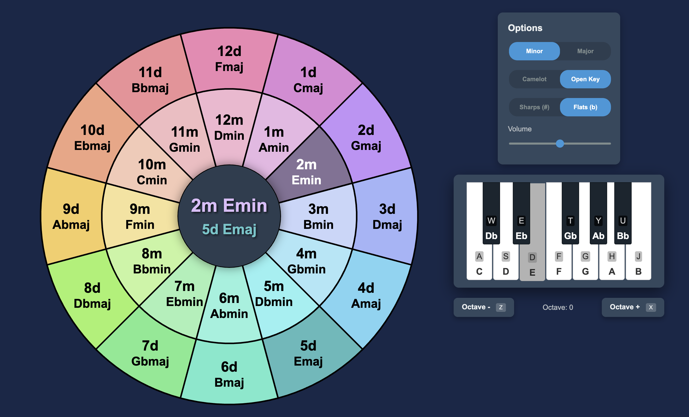

# DJKeyTool

Web-based key visualization and playback tool to help DJs when adding key info to tracks. Supports options for major or minor, Camelot or Open Key notations, and sharps or flats.

Download files to run locally or run from [github.io](https://chasedurand.github.io/DJKeyTool/)

    

